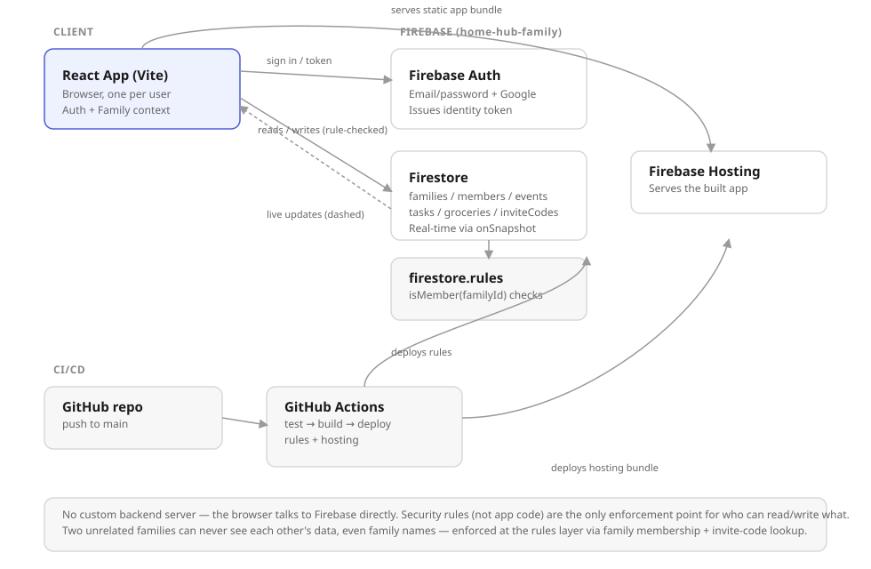

# Architecture



## Overview

Home Hub has no custom backend server. The React app (built with Vite) talks directly to Firebase from the browser — Firebase Authentication for identity, Firestore for data. There's nothing running in between; **security rules, not application code, are the only enforcement point** for who can read or write what.

## Components

**React App (client)** — one instance per signed-in user, running in their browser. Holds two React contexts: `AuthContext` (wraps Firebase Auth — sign up/in, sign out, current user) and `FamilyContext` (resolves which family the signed-in user belongs to, and exposes `createFamily`/`joinFamily`). Talks to Firestore exclusively through `frontend/src/db.js`, which every page (`CalendarPage`, `TasksPage`, `GroceryPage`, `HomePage`, `SettingsPage`) calls into instead of touching Firestore directly.

**Firebase Authentication** — issues each user an identity token after they sign in with email/password or Google. That token is what Firestore's security rules check (`request.auth.uid`) on every read and write; there is no separate session/API layer.

**Firestore** — the database. All family data lives under `families/{familyId}/...` (see "Data model" below). Reads/writes go through the SDK directly from the browser, gated by `firestore.rules`. The app also opens `onSnapshot` listeners on the family's `members`/`events`/`groceries`/`tasks` collections, so changes made on one device (e.g. your wife's phone) show up on another within a second or two, no refresh needed.

**firestore.rules** — the actual access-control layer. Central helper: `isMember(familyId)` checks that a `families/{familyId}/members/{request.auth.uid}` document exists for the signed-in user. Every family-scoped collection (`events`, `tasks`, `groceries`, `members`, and the `families/{familyId}` doc itself) requires `isMember(familyId)` to read or write. See "Privacy model" below for the one deliberate exception (`inviteCodes`).

**Firebase Hosting** — serves the built static app (`frontend/dist`) at `https://home-hub-family.web.app`. Just a CDN for the compiled bundle; no server-side logic runs here.

**Cloud Functions (`functions/`)** — the one place with server-side code, and only because two things can't live in the browser: a Strava/Terra client secret, and a webhook endpoint Terra can POST to. `stravaExchangeCode`/`stravaSync` and `terraGenerateWidgetSession`/`terraSync` are `onCall` functions (authenticated, invoked from the Training page via the Firebase SDK); `terraWebhook` is a raw `onRequest` HTTP endpoint that Terra calls directly (see "Fitness data sync" below). Requires the Blaze plan (Spark doesn't support Cloud Functions).

**GitHub Actions** — two workflows, one per environment. `.github/workflows/deploy-prod.yml` runs on every push to `main`: checks out the repo, installs dependencies, runs the test suite, builds the app, deploys to Firebase Hosting, and deploys `firestore.rules`/`firestore.indexes.json` — all against the production project (`home-hub-family`). `.github/workflows/deploy-dev.yml` runs the identical pipeline on pushes to `develop`, but against a wholly separate Firebase project (`home-hub-family-dev`) via GitHub Environment-scoped secrets. Nobody deploys by hand either way.

## Environments

Production and development are two independent Firebase projects — separate Auth users, separate Firestore, separate everything — not two collections in one project. This is deliberate: it means local development (`npm run dev`, pointed at the dev project via `frontend/.env.local`) and in-progress feature branches can never read or write real family data, and a bug in a dev-only code path can't corrupt production. See `scripts/setup-dev-env.sh` and README.md's "Environments" section for setup.

## Data model

```
families/{familyId}                    — { name, ownerUid, inviteCode, createdAt }
families/{familyId}/members/{uid}      — { uid, name, color, role, joinedAt }
families/{familyId}/events/{eventId}   — { title, date, startTime, endTime, owner, notes, createdAt }
families/{familyId}/tasks/{taskId}     — { type, title, category, dueDate, owner, recurrence, done, notes, createdAt }
families/{familyId}/groceries/{itemId} — { name, quantity, category, checked, addedBy, weekStart, createdAt }
families/{familyId}/trainingProfiles/{uid} — { raceName, raceDateISO, raceDistanceMiles, targetTimeMinutes,
                                              recentRaceDistanceMiles, recentRaceTimeMinutes,
                                              currentWeeklyMileage, longestRecentRunMiles, days,
                                              equipment, injuryNotes, updatedAt }
families/{familyId}/ideas/{ideaId}     — { title, type, status, notes, createdAt }
families/{familyId}/stravaTokens/{uid} — { accessToken, refreshToken, expiresAt, athleteId, updatedAt }
users/{uid}                            — { uid, email, familyId }  (maps a signed-in user to their family)
inviteCodes/{code}                     — { familyId }  (nothing else)
```

`trainingProfiles/{uid}` also holds the fitness-provider connection state: `stravaConnected` (bool), and `terraConnected`/`terraUserId`/`terraProvider` once Terra's widget flow completes. `stravaTokens/{uid}` is a separate collection (rather than fields on the profile) purely so its own Firestore rule can restrict it to `request.auth.uid == uid` alongside `trainingProfiles`, without needing a field-level rule; Terra doesn't need an equivalent collection since it holds no long-lived OAuth tokens on this app's side — Terra's own backend keeps the provider connection alive and pushes data via webhook instead.

`owner` (and `addedBy`) is either a specific member's `uid` or the synthetic `"all"` value for anything shared with the whole family — that's what the Combined/individual filter checks. Events with `trainingPlan: true` are the one deliberate exception: `CalendarPage.jsx`/`HomePage.jsx` filter them out for anyone but the owner, so a personal training plan doesn't clutter — or leak pace/mileage detail into — everyone else's Combined view, even though the underlying `events` collection itself is still family-readable at the rules level (same as every other event). `trainingProfiles/{uid}` goes further: `firestore.rules` restricts it to `request.auth.uid == uid`, so unlike everything else in this app, another family member can't read it at all, not even by querying Firestore directly. `frontend/src/lib/trainingPlan.js` generates the plan from that profile — race distance, goal time, a recent race result (used for a Riegel-formula pace prediction if given), current mileage, and preferred training days — so it's a general plan builder, not specific to any one race.

## Privacy model

Two unrelated families can never see each other's data — not even each other's family *name*. `firestore.rules` only lets a signed-in user read/write a family's documents if they have a `members/{their-uid}` doc in that family.

The one wrinkle: joining a family by invite code needs *some* way to look up a family from a code before you're a member of it. Firestore rules can't restrict *which* documents a query is allowed to match — only whether matched documents are readable — so a direct query across the `families` collection would've forced every family's name/owner to be readable by any signed-in user, including strangers. Instead, `joinFamily()` resolves the code through a separate `inviteCodes/{code} → { familyId }` lookup: a single get-by-exact-id, allowed for any signed-in user (since you have to already know the 6-character code), with `list`/enumerate blocked so nobody can browse or guess their way through every code that exists. The real `families/{familyId}` document — name, owner, everything else — stays members-only.

## Fitness data sync (Strava + Terra)

Training sessions can auto-fill their "actual" distance/duration/pace from a real workout, matched by date to the scheduled session. Two providers are wired in, both using the same Cloud Functions pattern (`resolveFamilyId`/`requireAuth` helpers, batch Firestore updates, identical `actualDistanceMiles`/`actualDurationMinutes`/`actualPaceMinPerMile`/`sessionStatus` fields written onto the matched event) so the UI doesn't need provider-specific rendering logic beyond a label:

- **Strava** — classic OAuth: the user clicks Connect, Strava redirects back with a `?code=`, `stravaExchangeCode` exchanges it server-side for tokens (client secret never reaches the browser), `stravaSync` is called on demand to pull recent activities and match them to sessions. Limited to 10 athletes on Strava's free API tier, with a paid subscription now required for the Standard Tier as of June 2026 — fine for one person, not for a household of friends on different platforms.
- **Terra** (tryterra.co) — a unified aggregator covering Garmin, Fitbit, Apple Health, Oura, Whoop, Polar, Strava, and 500+ providers behind one integration, chosen to sidestep Garmin's business-only developer program and Strava's athlete cap. Its connect flow is hosted rather than a classic OAuth redirect: `terraGenerateWidgetSession` asks Terra for a one-time widget URL (tagged with `reference_id: uid` so the connection can be traced back to the Firebase user), the browser is redirected there, and Terra handles the provider picker and auth entirely off this app's infrastructure. The result arrives asynchronously at `terraWebhook` (an `onRequest` endpoint, not a callable, since Terra — not the browser — is the caller) as an `auth` event; activities likewise arrive as `activity` events, or can be pulled on demand via `terraSync`. `terraWebhook` verifies Terra's `terra-signature` header (`t=<timestamp>,v1=<hmac-sha256 of "timestamp.rawBody">`) against the raw request body before trusting anything in the payload — the one HTTP endpoint in this app that isn't behind Firebase Auth, so signature verification is what stands in for that.

## Auth

Email/Password and Google sign-in are both enabled via Firebase Authentication. Neither adds multi-factor authentication on its own — Google sign-in just delegates the login step to Google, so if a family member has 2-Step Verification on their Google account, that protects Home Hub's login for free, with no Firebase configuration. Native Firebase MFA (TOTP or SMS) is not currently wired in; TOTP would be the better option if added later since it has no per-use cost, but it requires the Identity Platform/Blaze upgrade to enable.

## Cost

Firebase has two plans: Spark (free) and Blaze (pay-as-you-go, same free allocations plus billed overage). At household scale — a couple of families checking a shared calendar/tasks/groceries a few times a day — usage stays well within Spark's free limits and this app should cost **$0/month**.

| Service | Spark (free) limit | Blaze overage rate |
|---|---|---|
| Firestore | 50k reads / 20k writes / 20k deletes per day, 1 GiB storage | $0.06 / 100k reads, $0.18 / 100k writes, $0.02 / 100k deletes |
| Authentication | 50,000 monthly active users (email/social) | — |
| Hosting | 10 GB storage, 360 MB/day transfer | $0.026 / GB stored, $0.15 / GB transferred |
| GitHub Actions | Unlimited minutes on a public repo | — |

Spark simply blocks requests once a daily quota is hit rather than billing you, so there's no surprise-charge risk unless you deliberately upgrade to Blaze — which isn't necessary at this app's expected usage.

Sources: [Firebase Pricing](https://firebase.google.com/pricing), [Firebase Pricing 2026 — BudgetForge](https://www.budgetforge.dev/tools/firebase-pricing-2026), [Add TOTP MFA — Firebase docs](https://firebase.google.com/docs/auth/web/totp-mfa).
